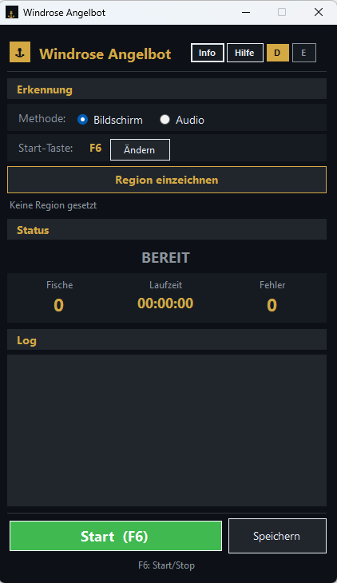
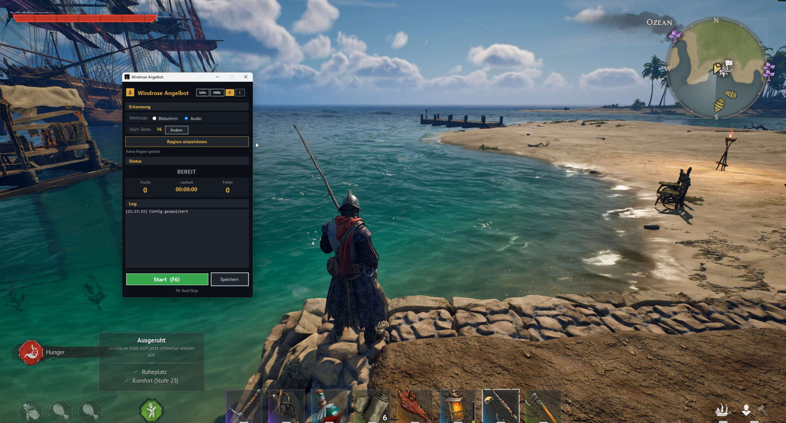
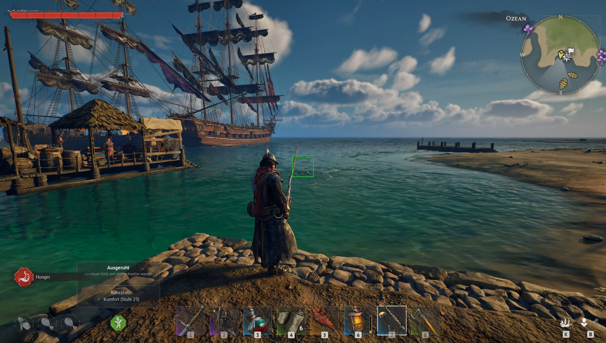

# AngelBot

**AngelBot** is a powerful automation tool for **Windrose** developed by [digitalsolution.at](https://digitalsolution.at).  
It combines two completely independent detection systems so the bot can react flexibly to different in-game scenarios — whether triggered by sound or by visual cues.

> 🌐 **Available in English and German**

---

## The App

---

## Detection Systems

### Audio Detection

The audio detection system analyzes sounds in real time and reacts precisely to defined acoustic triggers — no visual input required.

---

### Visual Detection (Image Recognition)

The image recognition system uses computer vision to identify objects, patterns, or states on screen and respond accordingly.

---

## Download

Download the latest release here:

➡️ **[AngelBot.exe – Latest Release](../../releases/latest)**

---

## Requirements

- Windows 10 / 11
- [Windrose](https://windrose.digitalsolution.at) (Steam or Epic Games)

---

## Built by

[digitalsolution.at](https://digitalsolution.at)
